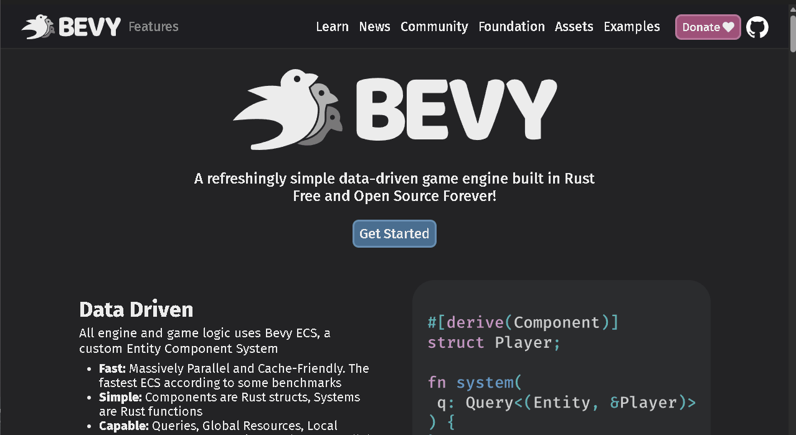

# bevy_webview_wry

[](https://crates.io/crates/bevy_webview_wry)
[](https://github.com/not-elm/bevy_webview_wry#license)
[](https://crates.io/crates/bevy_webview_wry)

> [!CAUTION]
> This crate is in the early stages of development and is subject to breaking changes.

## Purpose

The purpose of this crate is integrate [bevy](https://github.com/bevyengine/bevy)
and [wry](https://github.com/tauri-apps/wry) using [bevy_flurx](https://github.com/not-elm/bevy_flurx).

## Supported platforms

| Platform | usable |
|----------|--------|
| Windows  | ✅      |
| MacOS    | ✅      |
| Linux    | ❌      |
| Web      | ❌      |

## Setup

### Main process(bevy)

Add this to your `Cargo.toml`:

```toml
[dependencies]
bevy_webview_wry = "0.1"

# necessary if you want to use ipc-command.
bevy_flurx = "0.9"
bevy_flurx_ipc = "0.1"
bevy_flurx_api = "0.1"
```

### Ui process(webview)

```shell
# optional if you want to use ipc-command.
pnpm i bevy_flurx_api
```

Or, you can also use the API directly from `Window.__FLURX__` without installation.

## Usage

There are two ways to create a webview:

### Converts an existing window into a webview window.

[examples/wry/simple.rs](../../examples/wry/simple.rs)


```rust
fn spawn_webview(
    mut commands: Commands,
    window: Query<Entity, With<PrimaryWindow>>,
) {
    // Converts the `Window` attached the entity into a webview window. 
    commands
        .entity(window.single())
        .insert(WebviewUri::new("https://bevyengine.org/"));
}
```

### Child window

This feature is required `child_window` feature flag.

[examples/wry/child_window.rs](../../examples/wry/child_window.rs)


### Embedding Webview in a Window (Experimental)

[examples/wry/embedding.rs](../../examples/wry/embedding.rs)


## Ipc

### IpcEvent

You can listen events from the webview and, conversely, emit events to the webview.

#### Webview(javascript) -> bevy

[examples/wry/event_listen.rs](../../examples/wry/event_listen.rs)

___javascript___

```javascript
// you can use any type.
const event = {
    message: "message"
};
window.__FLURX__.emit("event_id", event);
```

___rust___

```rust
use bevy::prelude::*;
use bevy_webview_wry::prelude::*;
use serde::Deserialize;

#[derive(Deserialize, Debug)]
struct MessageFromWebview {
    message: String,
}

fn read_webview_message(
    mut er: EventReader<IpcEvent<MessageFromWebview>>
) {
    for e in er.read() {
        println!("webview message: {}", e.payload.message);
    }
}
```

#### bevy -> Webview(javascript)

[examples/wry/event_emit.rs](../../examples/wry/event_emit.rs)

___javascript___

```javascript
const webviewWindow = window.__FLURX__.WebWindow.current()
webviewWindow.listen("count_event", (event) => {
    console.log(event);
});
```

___rust___

```rust
fn emit_event(
    mut timer: ResMut<CountTimer>,
    mut views: Query<&mut EventEmitter>,
    mut count: Local<usize>,
    time: Res<Time>,
) {
    if timer.0.tick(time.delta()).finished() {
        *count += 1;
        for mut emitter in views.iter_mut() {
            emitter.emit("count_event", serde_json::json!({
                "count" : *count
            }));
        }
    }
}
```

### IpcCommand

`IpcEvent` can't receive the output value from the other side.
In this case, `IpcCommand` can be used.

`IpcComamnd` can be divided into two command patterns: action-command, task-command

Please check  [examples/wry/ipc_command.rs](../../examples/wry/ipc_command.rs) for details.

## ChangeLog

Please see [here](https://github.com/not-elm/bevy_webview_wry/blob/main/CHANGELOG.md).

## Feature flags

| flag           | description                                 | default |
|----------------|---------------------------------------------|---------|
| `child_window` | allows you to create embedding child window | true    |

## Compatible Bevy versions

| bevy_webview_wry | bevy_flurx | bevy |
|------------------|------------|------|
| 0.1.0 ~          | 0.9        | 0.15 |

## License

This crate is licensed under the MIT License or the Apache License 2.0.

## Todo

- [ ] Support Linux(X11)
- [ ] Support Linux(Wayland)